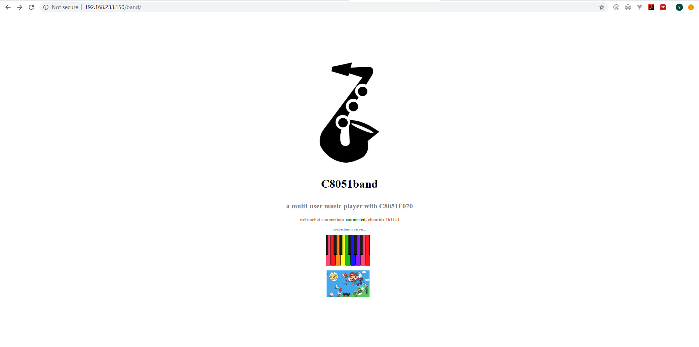
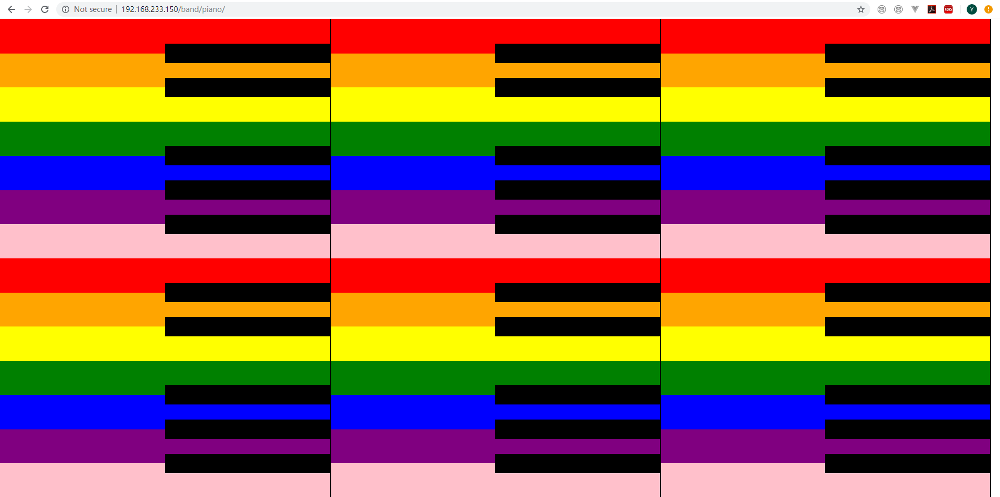
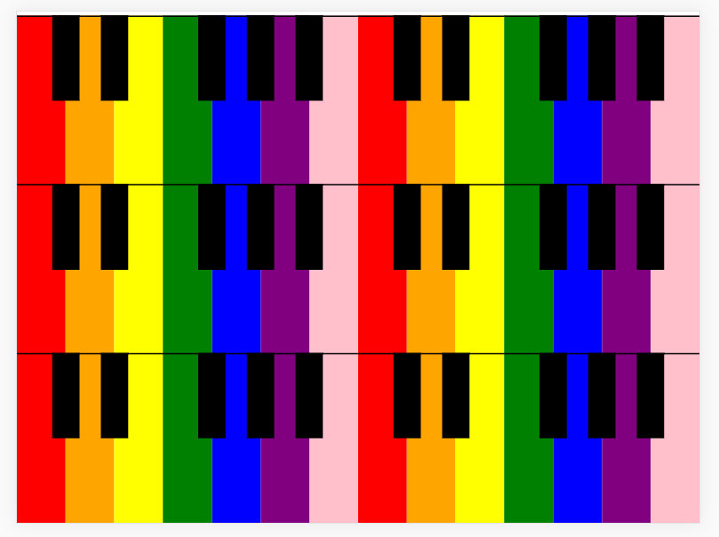
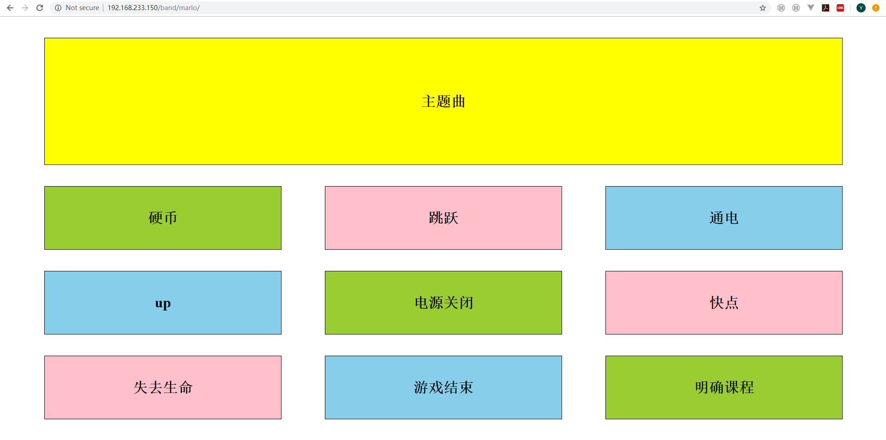
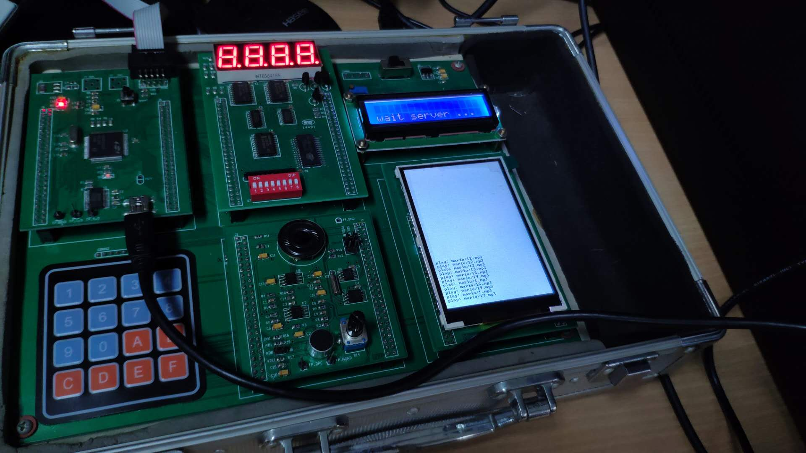

# 综合实验报告

吴越 1600012704

## 实验目标

完成一个能够多人同时弹奏的电子琴

## 实验方案

1. 由于实验箱无触摸屏且按键有限（16个按键只能完成不到2个八度音域，且操作不便），需要结合外部用户的电脑键盘或手机触摸屏来实现较好的弹奏效果，此外实验箱的16个按键也可用于弹奏，但只能弹奏有限的音符
2. 一般电子琴的音色非常好听，相应地需要存储的信息就比较多，比如实验箱的8kS/s DAC采样率，正常钢琴音会持续2~3秒（低音更长），即使压缩也有总共5MB左右，而解压这些MP3变成8kHz采样率，2byte整形的数据，也有13MB左右，且MP3解码复杂，无论是裸数据存储还是压缩数据存储再解压都不是C8051F020能够胜任的事情，于是我选择将单片机和PC结合，使用PC进行复杂的解码和混频操作，而把实验箱当作外设使用
3. 为了进一步指示实验箱的状态，使用液晶显示器+TFT屏共同显示，其中1602液晶显示器用来显示连接主机的状态，液晶屏则开机显示固件版本信息，并且弹奏过程中滚动显示弹奏的音符/音乐

## 代码量

单片机代码：约600行

server代码：约500行

网页代码：主页80行，马里奥和钢琴各100行，自己编写的与服务器通信库60行

## 操作说明

使用者首先需要准备一台linux电脑（我使用的是Ubuntu16.04），并从[本项目GitHub仓库（https://github.com/wuyuepku/C8051band）](https://github.com/wuyuepku/C8051band)上下载源码。源码的`mcuproj/`文件夹下是单片机的代码，使用Keil uVision5（我是用win10打开）打开并烧录进单片机中，此时单片机将等待server连接（显示在1602液晶屏上）

第二步是编译PC端server程序，在项目根目录下进行`make`操作。为了debug方便，我首先实现了在电脑上播放音频，这个过程需要SDL2的库，可以从源码编译安装；如果不需要这一步，可以忽略，`server.cpp`中有一个`WITH_SDL`的宏，注释掉就可以忽略SDL2库并直接使用串口连接单片机。

为了实时性，程序中将进程设为了实时进程，所以需要sudo权限

同时，还需要根据项目根目录的README文件合理配置Nginx和Mosquitto，才能正常访问操作网页

访问网页，获得如下主界面

如果显示绿色的connected，说明websocket连接正常，同时下面一行小字如果显示server的编译时间等版本信息，则说明server也检测到并连接上了。

电机钢琴的图片，进入全音域钢琴弹奏页面

在电脑上实现效果不太好，实际上在手机或平板电脑上效果不错，比如iPad显示比例如下，比较适合弹奏，如下图

而下面的超级马里奥图标点进去可以播放音乐，如下：

点击”主题曲“可以播放马里奥的主题曲，再点一下取消播放（设立这个功能是因为这个曲子太长了，如果不能取消会非常烦人）

实验箱运行时照片如下：

